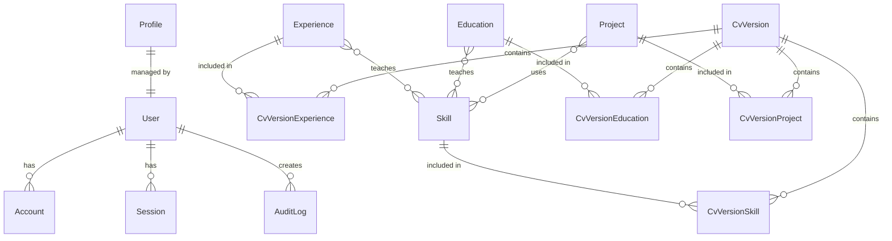

# Base de données

## 🗄️ Vue d'ensemble

L'application utilise **PostgreSQL** comme base de données relationnelle, avec **Prisma** comme ORM pour la gestion du schéma et les requêtes type-safe.

## 📊 Schéma de la base de données

### Modèle de données complet



## 📋 Modèles détaillés

### 1. Authentification (NextAuth.js)

#### User
Table principale des utilisateurs avec gestion des rôles.

```prisma
model User {
    id            String     @id @default(cuid())
    name          String?
    email         String?    @unique
    passwordHash  String?
    emailVerified DateTime?
    image         String?
    role          String     @default("viewer")
    accounts      Account[]
    sessions      Session[]
    AuditLogs     AuditLog[]
}
```

**Champs clés :**
- `id` : Identifiant unique (CUID)
- `email` : Email unique pour la connexion
- `passwordHash` : Mot de passe haché avec Argon2
- `role` : Rôle de l'utilisateur (`viewer`, `admin`)

#### Account
Comptes de connexion liés (OAuth, etc.).

```prisma
model Account {
    id                       String  @id @default(cuid())
    userId                   String
    type                     String
    provider                 String
    providerAccountId        String
    refresh_token            String?
    access_token             String?
    expires_at               Int?
    token_type               String?
    scope                    String?
    id_token                 String?
    session_state            String?
    user                     User    @relation(fields: [userId], references: [id], onDelete: Cascade)
    refresh_token_expires_in Int?

    @@unique([provider, providerAccountId])
}
```

#### Session
Sessions actives des utilisateurs.

```prisma
model Session {
    id           String   @id @default(cuid())
    sessionToken String   @unique
    userId       String
    expires      DateTime
    user         User     @relation(fields: [userId], references: [id], onDelete: Cascade)
}
```

#### VerificationToken
Tokens pour la vérification d'email.

```prisma
model VerificationToken {
    identifier String
    token      String   @unique
    expires    DateTime

    @@unique([identifier, token])
}
```

### 2. Profil

#### Profile
Informations du profil personnel (singleton).

```prisma
model Profile {
    id String @id @default("profile")

    fullName  String
    headline  String?
    location  String?
    website   String?
    email     String?
    phone     String?
    jobTitle  String?
    aboutMd   String?      // Markdown pour la bio
    createdAt DateTime @default(now())
    updatedAt DateTime @updatedAt
}
```

**Particularités :**
- ID fixe `"profile"` : Un seul profil par application
- `aboutMd` : Contenu markdown pour une bio riche

#### Link
Liens sociaux et professionnels.

```prisma
model Link {
    id String @id @default(cuid())

    name       String
    url        String
    icon       String?
    orderIndex Int      @default(0)
    createdAt  DateTime @default(now())
    updatedAt  DateTime @updatedAt
}
```

### 3. Compétences

#### Skill
Compétences techniques et soft skills.

```prisma
model Skill {
    id String @id @default(cuid())

    name       String
    level      String?      // "Débutant", "Intermédiaire", "Expert"
    icon       String?
    orderIndex Int      @default(0)
    createdAt  DateTime @default(now())
    updatedAt  DateTime @updatedAt

    Experiences Experience[] @relation("AquiredInExperience")
    Educations  Education[]  @relation("AquiredInEducation")
    Projects    Project[]    @relation("AquiredInProject")
    CVs         CvVersionSkill[]
}
```

**Relations :**
- Liée aux expériences, formations et projets où elle a été acquise
- Peut être incluse dans plusieurs versions de CV

### 4. Formations

#### Education
Parcours académique et certifications.

```prisma
model Education {
    id String @id @default(cuid())

    school     String
    degree     String?      // Diplôme obtenu
    startDate  DateTime?
    endDate    DateTime?
    detailsMd  String?      // Détails en markdown
    orderIndex Int       @default(0)
    createdAt  DateTime  @default(now())
    updatedAt  DateTime  @updatedAt

    Skills Skill[] @relation("AquiredInEducation")
    CVs    CvVersionEducation[]
}
```

### 5. Expériences professionnelles

#### Experience
Parcours professionnel.

```prisma
model Experience {
    id String @id @default(cuid())

    company    String
    companyUrl String?
    role       String
    startDate  DateTime?
    endDate    DateTime?
    location   String?
    summaryMd  String?      // Description en markdown

    type ExperienceType @default(WORK)

    orderIndex Int      @default(0)
    createdAt  DateTime @default(now())
    updatedAt  DateTime @updatedAt

    public Boolean @default(true)

    CVs    CvVersionExperience[]
    Skills Skill[] @relation("AquiredInExperience")
}
```

**Type d'expérience :**
```prisma
enum ExperienceType {
    PERMANENT       // CDI
    FIXED_TERM     // CDD
    APPRENTICESHIP // Alternance
    INTERNSHIP     // Stage
    FREELANCE      // Freelance
    VOLUNTEER      // Bénévolat
    WORK           // Autre travail
}
```

### 6. Projets

#### Project
Portfolio de projets personnels et professionnels.

```prisma
model Project {
    id String @id @default(cuid())

    name      String
    summaryMd String?      // Description markdown
    url       String?      // URL du projet déployé
    repoUrl   String?      // URL du repository

    orderIndex Int      @default(0)
    createdAt  DateTime @default(now())
    updatedAt  DateTime @updatedAt

    CVs    CvVersionProject[]
    Skills Skill[] @relation("AquiredInProject")
}
```

### 7. Versions de CV

#### CvVersion
Différentes versions de CV personnalisables.

```prisma
model CvVersion {
    id String @id @default(cuid())

    title        String
    slug         String   @unique
    theme        String   @default("modern")
    sectionOrder Json     // Ordre des sections
    createdAt    DateTime @default(now())
    updatedAt    DateTime @updatedAt

    Experiences CvVersionExperience[]
    Projects    CvVersionProject[]
    Skills      CvVersionSkill[]
    Educations  CvVersionEducation[]
}
```

**Tables de liaison (Many-to-Many) :**

```prisma
model CvVersionExperience {
    cvId         String
    experienceId String
    CV           CvVersion  @relation(fields: [cvId], references: [id], onDelete: Cascade)
    experience   Experience @relation(fields: [experienceId], references: [id], onDelete: Cascade)

    @@id([cvId, experienceId])
}

model CvVersionProject {
    cvId      String
    projectId String
    CV        CvVersion @relation(fields: [cvId], references: [id], onDelete: Cascade)
    project   Project   @relation(fields: [projectId], references: [id], onDelete: Cascade)

    @@id([cvId, projectId])
}

model CvVersionSkill {
    cvId    String
    skillId String
    CV      CvVersion @relation(fields: [cvId], references: [id], onDelete: Cascade)
    Skill   Skill     @relation(fields: [skillId], references: [id], onDelete: Cascade)

    @@id([cvId, skillId])
}

model CvVersionEducation {
    cvId        String
    educationId String
    CV          CvVersion @relation(fields: [cvId], references: [id], onDelete: Cascade)
    Education   Education @relation(fields: [educationId], references: [id], onDelete: Cascade)

    @@id([cvId, educationId])
}
```

### 8. Audit Log

#### AuditLog
Traçabilité des actions effectuées.

```prisma
model AuditLog {
    id String @id @default(cuid())

    action     AuditAction
    targetType AuditTargetType
    targetId   String?
    meta       Json?
    createdAt  DateTime @default(now())

    authorId String?
    Author   User?   @relation(fields: [authorId], references: [id], onDelete: Cascade)
}

enum AuditAction {
    CREATE
    READ
    UPDATE
    DELETE
}

enum AuditTargetType {
    USER
    PROFILE
    SKILL
    EDUCATION
    EXPERIENCE
    PROJECT
    CV
    LINK
}
```

## 🔧 Gestion avec Prisma

### Client Prisma

```typescript
// src/server/db.ts
import { PrismaClient } from "@prisma/client";

const createPrismaClient = () =>
  new PrismaClient({
    log:
      env.NODE_ENV === "development"
        ? ["query", "error", "warn"]
        : ["error"],
  });

const globalForPrisma = globalThis as unknown as {
  prisma: ReturnType<typeof createPrismaClient> | undefined;
};

export const db = globalForPrisma.prisma ?? createPrismaClient();

if (env.NODE_ENV !== "production") globalForPrisma.prisma = db;
```

### Commandes Prisma

```bash
# Générer le client Prisma
pnpm db:generate

# Appliquer le schéma à la DB (dev)
pnpm db:push

# Créer et appliquer une migration (prod)
pnpm db:migrate

# Ouvrir Prisma Studio (GUI)
pnpm db:studio

# Peupler la base de données
pnpm seed
```

### Migrations

Les migrations sont stockées dans `prisma/migrations/` et versionnées.

```bash
# Créer une nouvelle migration
npx prisma migrate dev --name add_user_role

# Appliquer les migrations en production
npx prisma migrate deploy

# Réinitialiser la base de données (dev uniquement!)
npx prisma migrate reset
```

## 📝 Bonnes pratiques

### 1. Utiliser les relations Prisma

```typescript
// ❌ Mauvais : Requêtes multiples
const experience = await db.experience.findUnique({ where: { id } });
const skills = await db.skill.findMany({
  where: { Experiences: { some: { id } } }
});

// ✅ Bon : Inclusion des relations
const experience = await db.experience.findUnique({
  where: { id },
  include: { Skills: true }
});
```

### 2. Utiliser select pour les performances

```typescript
// ❌ Mauvais : Récupère tous les champs
const users = await db.user.findMany();

// ✅ Bon : Sélectionne uniquement les champs nécessaires
const users = await db.user.findMany({
  select: { id: true, name: true, email: true }
});
```

### 3. Utiliser les transactions pour l'atomicité

```typescript
// Transaction avec operations multiples
await db.$transaction([
  db.experience.create({ data: newExperience }),
  db.skill.createMany({ data: newSkills }),
]);
```

### 4. Gestion des soft deletes (optionnel)

```typescript
// Au lieu de supprimer, marquer comme supprimé
await db.experience.update({
  where: { id },
  data: { deletedAt: new Date() }
});

// Filtrer les éléments supprimés
const activeExperiences = await db.experience.findMany({
  where: { deletedAt: null }
});
```

## 🔍 Indexation

Les index suivants sont automatiquement créés par Prisma :
- `@id` : Index unique sur la clé primaire
- `@unique` : Index unique (email, slug, etc.)
- Foreign keys : Index automatiques sur les relations

## 🚀 Optimisations

### Connection Pooling
Prisma gère automatiquement un pool de connexions à PostgreSQL.

### Query Optimization
- Utiliser `select` pour limiter les champs
- Utiliser `include` intelligemment
- Éviter les N+1 queries avec `include`

### Caching
React Query (via tRPC) gère le cache côté client automatiquement.

## 📚 Ressources

- [Prisma Documentation](https://www.prisma.io/docs)
- [PostgreSQL Documentation](https://www.postgresql.org/docs/)
- [Prisma Best Practices](https://www.prisma.io/docs/guides/performance-and-optimization)
